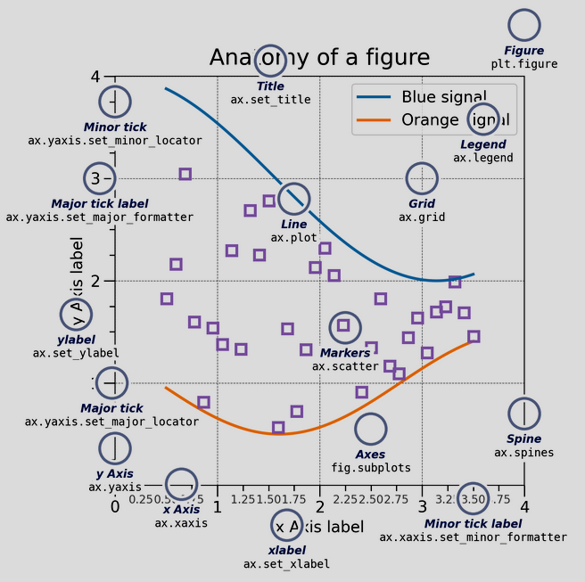
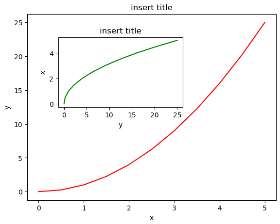

# Matplotlib

- One can change the following options:


## Subplots

- Example:
```python
import matplotlib.pyplot as plt

# we create a fig contain subplots in a grid
# custom fontsize, linewidth, tick width
def show3_time_series(rpt, rp, ipt, ip, pt, p) -> None:
    # defaults are: figsize=(6.4, 4.8) width and height in inches, dpi=100 default
    fs = 20  # fontsize
    lw = 5  # linewidth
    fig = plt.figure(figsize=[30, 10], dpi=100)
    fig.suptitle("Consecutive Time Series Whole Process", fontsize=fs * 1.5)
    # grid definition
    ax1 = fig.add_subplot(131)
    ax2 = fig.add_subplot(132)
    ax3 = fig.add_subplot(133)
    axs = [ax1, ax2, ax3]
    # common setup is made in a for loop
    for ax in axs:
        ax.minorticks_on()
        ax.tick_params("both", length=20, width=2, which="major", labelsize=fs)
        ax.tick_params("both", length=10, width=1, which="minor", labelsize=fs)
        ax.set_xlabel("Time (ms)", fontsize=fs)
    ax1.plot(rpt, rp, color="c", linewidth=lw)
    ax1.set_title("Ram Position", fontsize=fs)
    ax1.set_ylabel("Ram Position", fontsize=fs)
    ax2.plot(ipt, ip, color="y", linewidth=lw)
    ax2.set_title("Injection Pressure", fontsize=fs)
    ax2.set_ylabel("Injection Pressure", fontsize=fs)
    ax2.set(xlabel="Time (ms)", ylabel="Injection Pressure")
    ax3.plot(pt, p, color="purple", linewidth=lw)
    ax3.set_title("Sensor Pressure", fontsize=fs)
    ax3.set_ylabel("Sensor Pressure", fontsize=fs)
    plt.show()
```

## Nested Plots

- Example

```python
fig = plt.figure()

# Values are given in percentages
axes1 = fig.add_axes([0.1, 0.1, 0.8, 0.8])  # main axes
axes2 = fig.add_axes([0.2, 0.5, 0.4, 0.3])  # inset axes

# main figure
axes1.plot(x, y, 'r')
axes1.set_xlabel('x')
axes1.set_ylabel('y')
axes1.set_title('insert title');

# insert
axes2.plot(y, x, 'g')
axes2.set_xlabel('y')
axes2.set_ylabel('x')
axes2.set_title('insert title');
```


